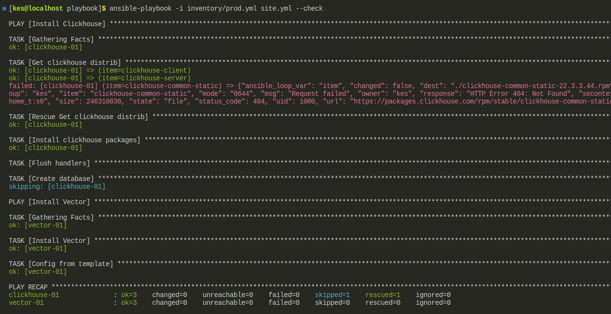

# Домашнее задание к занятию 2 «Работа с Playbook»

5. Запустите `ansible-lint site.yml` и исправьте ошибки, если они есть.


- исправление ошибок:


6. Попробуйте запустить playbook на этом окружении с флагом `--check`.



7. Запустите playbook на `prod.yml` окружении с флагом `--diff`. Убедитесь, что изменения на системе произведены.


8. Повторно запустите playbook с флагом `--diff` и убедитесь, что playbook идемпотентен.


---
9. Подготовьте README.md-файл по своему playbook. В нём должно быть описано: что делает playbook, какие у него есть параметры и теги. Пример качественной документации ansible playbook по [ссылке](https://github.com/opensearch-project/ansible-playbook). Так же приложите скриншоты выполнения заданий №5-8
10. Готовый playbook выложите в свой репозиторий, поставьте тег `08-ansible-02-playbook` на фиксирующий коммит, в ответ предоставьте ссылку на него.
---

## Clickhouse+Vector Ansible-playbook

Clickhouse & vector setup

## Clickhouse&Vector Versions

* Clickhouse version: 22.3.3.44
* Vector version: 0.36.0


## Infrastructure requrements
* 2 hosts (Centos 7 VM's), details in inventory/prod.yml

## Playbook tasks:
1'st host:
* Download Clickhouse RPM-packages (clickhouse-client, clickhouse-server, clickhouse-common-static)
* Install downloaded Clickhouse packages
* Start Clickhouse service
* Create database for logs

2'nd host:
* Download and install Vector RPM via YUM package menager
* Configuring vector service from template (templates/vector.j2)

## INSTALL

```
ansible-playbook -i inventory/prod.yml site.yml
```

## TAGS

Use
```
ansible-playbook -i inventory/prod.yml site.yml --tags <tag name>
```
Available tags name:
* "Clickhouse" - for clickhouse download tasks
* "Vector" - for Vector install
* "VectorConf" - for configure Vector from template


---
